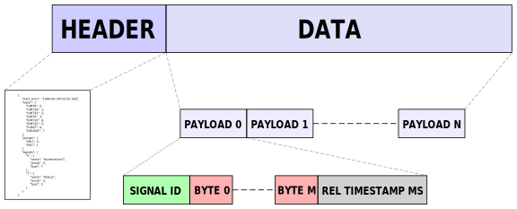
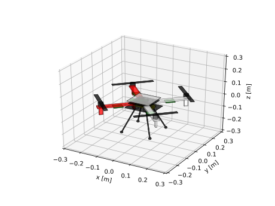
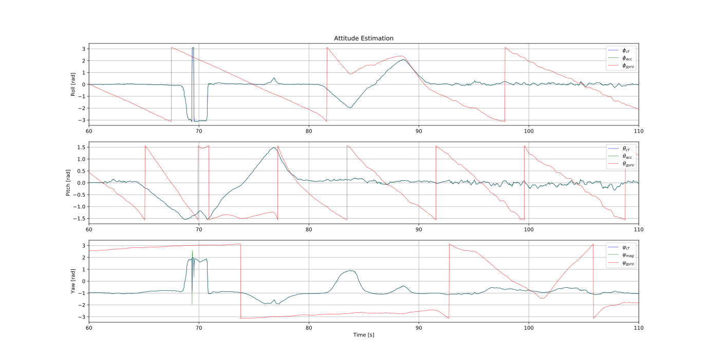

Drone
*****************
The drone a.k.a "Ugglan" (Swedish for owl) is a DIY build
quadcopter, using the Raspberry Pi Zero.

Some in-depth parts of the Modeling, State Estimation and Control
are not covered in this document, for details see the arthur's master thesis
`Design, Modeling and Control of an Octocopter <http://www.diva-portal.org/smash/get/diva2:857660/FULLTEXT01.pdf>`_.

Software
=================

Tasks
---------------
The drone's top level software design can be seen as a task manager, (asynchronous
and synchronous) solving the producer and consumer problem. Where the producers are
the sensors (IMU, ESC etc.). And where the control loop, data logging etc. are
the consumers, see :numref:`drone_sw_design`.

.. _drone_sw_design:
.. mermaid::
    :caption: Overview of the drone software design. Tasks are stadium-shaped nodes.

    graph LR
        ImuAccMag([ImuAccMag])
        ImuGyro([ImuGyro])
        ImuPres([ImuPres])

        EscRead([EscRead])
        RcReceiver([RcReceiver])

        DataLogQueue[(DataLogQueue)]

        StateControl([StateControl])
        EscWrite([EscWrite])
        DataLogger([DataLogger])

        ImuAccMag -- push 50 Hz --> DataLogQueue
        ImuGyro -- push 50 Hz --> DataLogQueue
        ImuPres -- push 10 Hz --> DataLogQueue
        EscRead -- push 5 Hz --> DataLogQueue
        RcReceiver -- push 50 Hz --> DataLogQueue

        DataLogQueue -- last value 50 Hz --> StateControl
        DataLogQueue -- last value 50 Hz --> EscWrite
        DataLogQueue -- pop 100 Hz --> DataLogger

        subgraph Producers
        ImuAccMag
        ImuGyro
        ImuPres
        EscRead
        RcReceiver
        end

        subgraph Consumers
        StateControl
        EscWrite
        DataLogger
        end

As one can see, the ``DataLogQueue`` maintains a thread safe queue for the producers to
push to and the ``DataLogger`` to pop from. But it also stores the last (pushed) sample
for consumers to use e.g., the ``StateControl`` which runs at a constant execution/sample
rate i.e. to simplify the signal processing. Note, other tasks than producers may populate
the queue e.g., estimated states which are useful for offline tuning of control laws.

Note, some signals such as the ones from the pressure sensor will only be sampled
at 10 Hz. This has to be handled by the state controller.

Data Logging
-----------------
The ``DataLogger`` handles the data serialization of signals e.g., the IMU acceleration
which is continuously written to disk. It consists of a **HEADER** section - a json string,
describing the content of the second **DATA PACKAGES** section. See :numref:`data_log_protocol`
for an illustration of the data-log protocol.

.. _data_log_protocol:

    The data logging protocol. The **SIGNAL ID** is an unique identifer for each signal/package
    and of type ``uint16``. The **REL TIMESTAMP** is the relative timestamp in ms
    between each **PACKAGE** and of type ``uint8``.

The json-file is compressed using gzip (and base64 encoded) to save space. See example
header below.

.. code-block:: json

    {
        "start_time": "1990-08-30T22:52:50Z",
        "types": {
            "0": "UINT8",
            "1": "UINT16",
            "2": "UINT32",
            "3": "SINT8",
            "4": "SINT16",
            "5": "SINT32",
            "6": "FLOAT",
            "7": "DOUBLE"
        },
        "groups": {
            "0": "IMU",
            "1": "ESC"
        },
        "signals": {
            "0": {
                "name": "AccelerationX",
                "group": 0,
                "type": 7
            },
            "1": {
                "name": "Status0",
                "group": 1,
                "type": 0
            }
        }
    }

Hardware
=================
.. _ugglan_in_person:
.. figure:: figures/ugglan_in_person.jpg
    :width: 50%

    Ugglan in person.

The drone hardware components are is listed below

* Raspberry Pi Zero
* Diatone Q450 with PCB
* Pololu AltIMU-10 v4
* Afro ESC 20 A
* Turnigy Evolution Digital AFHDS 2A RC transmitter & controller
* TGY-iA6C RC receiver
* ZIPPY Compact 3300mAh 3S (or similar)
* DC-DC step down voltage regulator 5V
* Turnigy 2830 900KV L2215J-900 Brushless Motor

In addition, miscellaneous self manufactured components such as a cut plexiglas
are used for mounting, see :numref:`ugglan_in_person`.

.. _devices_and_busses:

Devices & Busses
-----------------
The IMU's and ESC's are communicating with the Pi over i2c. The IMU can run at 400 kHz (fast mode)
and is using the built-in HW. But, the ESC's only run stable at 100 kHz (normal mode) and are
therefore using a SW implementation (i2c-gpio overlay, bit-banging over GPIO 23-24). The RC receiver
is communicating over UART, a serial connection. See overview in :numref:`connected_busses`.

.. _connected_busses:
.. mermaid::
    :caption: Overview of the hardware devices connected to the Pi Zero and their respective protocols.

    graph TD
        Esc_i -- i2c read 100 kHz --> Raspi
        Raspi -- i2c write 100 kHz --> Esc_i
        Imu_i -- i2c read 400 kHz --> Raspi
        RcReceiver -- uart read 115200 bps --> Raspi

Wiring
--------
.. _wiring_diagram:
.. figure:: figures/wiring_diagram.svg
    :width: 100%

    Wiring diagram.

Modeling
===============

.. _drone_multi_body:

    Multi body analysis of the drone.

Nomenclature
------------------
:math:`_{I}` Inertial reference frame

:math:`_{B}` Body reference frame

Inertia
------------------
Using multi body analysis of the drone and its components, the total drone
(mass and moments) inertia is estimated, see :numref:`drone_multi_body`.
This results in the following inertia estimates

.. math::

    I_{est} =
    \begin{bmatrix}
        0.014 & 0 & 0 \\
        0 & 0.014 & 0 \\
        0 & 0 & 0.026
    \end{bmatrix} \text{kgm}^2

and :math:`m_{est}=1.038` kg. For comparison, the measured weight is :math:`m_{meas}=1058` kg.
Also its center of mass w.r.t the top frame is located at :math:`CM_{est}=[0, -0.001, -0.006]` m.
Hence, a rather good weight distribution.

Motor Dynamics
------------------
TODO: Empirical Studies.

State Estimation
=================

Attitude Estimation
--------------------
For attitude control, the Euler angles :math:`\eta = [\phi, \theta, \psi]` and their respective
time derivatives (angular rates) :math:`\dot{\eta} = \omega` (in the linearized model) are
needed.

Here :math:`\omega` is simply given by the IMU's gyro, but :math:`\eta` has to be estimated. This
can be accomplished using all sensors (accelerometer, gyro and magnetometer) and is a common
problem. Without going into detail - geometrical relationships yield

.. math::

    \phi_{acc} &= \text{atan2}(-a_{By}, -a_{Bz}) \\
    \theta_{acc} &= \text{atan2}(a_{Bx}, \sqrt{a_{By}^2 + a_{Bz}^2}) \\
    \psi_{mag} &= \text{atan2}(m_{Iy}, m_{Ix})

where

.. math::

    m_{Ix} &= m_{Bx}\cos(\theta) + m_{By}\sin(\phi)\sin(\theta) + m_{Bz}\sin(\theta)\cos(\phi) \\
    m_{Iy} &= m_{By}\cos(\phi) - m_{Bz}\sin(\phi)

and :math:`a_B` is the acceleration and :math:`m_B` is the earths magnetic field supplied by the
IMU in the body frame. Where :math:`m_{Ix}` and :math:`m_{Iy}` are the magnetic fields in the
inertial frame.

These estimates can be improved by using the gyro and a simple first order complementary
filter (see `IMU Data Fusing <http://www.olliw.eu/2013/imu-data-fusing/>`_)

.. math::

    \tilde{\phi}^{k} &= \text{cf}(\phi_{acc}^k, \dot{\phi}_{gyro}^k, \tilde{\phi}^{k-1}, \tau_{\phi}) \\
    \tilde{\theta}^{k} &= \text{cf}(\theta_{acc}^k, \dot{\theta}_{gyro}^k, \tilde{\theta}^{k-1}, \tau_{\theta}) \\
    \tilde{\psi}^{k} &= \text{cf}(\psi_{mag}^k, \dot{\psi}_{gyro}^k, \tilde{\psi}^{k-1}, \tau_{\psi})

where

.. math::

    y^{k} &= \text{cf}(u^k, \dot{u}^k, y^{k-1}, \tau) \\
            &= \alpha(y^{k-1} + \dot{u}^k\Delta t) + (1-\alpha)u^k

where :math:`\alpha = \tfrac{\tau}{\tau + \Delta t}` and :math:`\tau` is the cut-off frequency
(:math:`\tau = \tfrac{1}{2 \pi f_c}`). Note that the estimates also need range limiting
(module of angles) and offset compensation.

In :numref:`attitude_estimation` the result of the attitude estimation is shown. Note the large
drift of the gyro.

.. _attitude_estimation:

    Attitude estimation of roll (:math:`\phi`), pitch (:math:`\theta`) and
    yaw (:math:`\psi`). Both unfiltered and complementary filter estimates.
    Here :math:`\tau_{\phi}=\tau_{\theta}=\tau_{\psi}` s.t. :math:`f_c=20` Hz.

Motor Torque Estimation
------------------------
TODO: Reduced observer. Summary of master thesis work.

Control
=================
TODO: Summary of master thesis work. With flow chart.

State Control
-----------------
TODO: Summary of master thesis work.

Motor Control
------------------
The body force and torque control inputs :math:`u_{Bz}`, :math:`u_{B\phi}`,
:math:`u_{B\theta}` and :math:`u_{B\psi}` have to be converted to individual
motor control inputs :math:`u_{M_i}`.

.. _motor_rotations:
.. figure:: figures/motor_rotations.svg
    :width: 75%

    The drone motor rotational directions.

From :numref:`motor_rotations` one can derive the drone body forces and
torques generated by the motors

.. math::

    f_{Bx} &= 0 \\
    f_{By} &= 0 \\
    f_{Bz} &= - f_{M_1z} - f_{M_2} - f_{M_3} - f_{M_4z} \\
    m_{Bx} &= - l_xf_{M_1z} - l_xf_{M_2z} + l_xf_{M_3z} + l_xf_{M_4z} \\
    m_{By} &=   l_xf_{M_1z} - l_xf_{M_2z} - l_xf_{M_3z} + l_xf_{M_4z} \\
    m_{Bz} &= - m_{M_1z} + m_{M_2z} - m_{M_3z} + m_{M_4z}

where :math:`f_{M_ix} = f_{M_iy} = m_{M_ix} = m_{M_iy} = 0` and
:math:`l_x = 0.23` [m] (distance between body center of mass and motor).

In order to solve for the motor inputs one can use the fact that
:math:`f, m \propto \omega^2`, where :math:`\omega` is the angular rate of a
motor/propeller, see :numref:`ang_rate_sq_vs_thrust`.

.. _ang_rate_sq_vs_thrust:
.. figure:: figures/ang_rate_sq_vs_thrust.svg
    :width: 100%

    Motor angular rate and its corresponding generated thrust. Positive
    rotation corresponds to the "intended" propeller rotation i.e., not
    driven in reverse. Fitted a 1st-order polynomial :math:`y = X[p_1]^\intercal`.

Hence, the generated body forces and torques can be described as following

.. math::

    \begin{bmatrix}
        f_{Bz} \\
        m_{Bx} \\
        m_{By} \\
        m_{Bz}
    \end{bmatrix} =
    \underbrace{
        \begin{bmatrix}
            -c_{fz} & -c_{fz} & -c_{fz} & -c_{fz} \\
            -l_xc_{fz} & -l_xc_{fz} & l_xc_{fz} & l_xc_{fz} \\
            l_xc_{fz} & -l_xc_{fz} & -l_xc_{fz} & l_xc_{fz} \\
            -c_{mz} & c_{mz} & -c_{mz} & c_{mz}
        \end{bmatrix}
    }_H
    \begin{bmatrix}
        \omega_{M_1z}^2 \\
        \omega_{M_2z}^2 \\
        \omega_{M_3z}^2 \\
        \omega_{M_4z}^2
    \end{bmatrix}.

By computing :math:`H^{-1}` one gets

.. math::

    [\omega_{M_1z}^2, \omega_{M_2z}^2, \omega_{M_3z}^2, \omega_{M_4z}^2]^\intercal
    = H^{-1} [f_{Bz}, m_{Bx}, m_{By}, m_{Bz}]^\intercal

where

.. math::
    H^{-1} = \frac{1}{4}
        \begin{bmatrix}
            -\tfrac{1}{c_{fz}} & -\tfrac{1}{l_xc_{fz}} & \tfrac{1}{l_xc_{fz}} & -\tfrac{1}{c_{mz}} \\
            -\tfrac{1}{c_{fz}} & -\tfrac{1}{l_xc_{fz}} & -\tfrac{1}{l_xc_{fz}} & \tfrac{1}{c_{mz}} \\
            -\tfrac{1}{c_{fz}} & \tfrac{1}{l_xc_{fz}} & -\tfrac{1}{l_xc_{fz}} & -\tfrac{1}{c_{mz}} \\
            -\tfrac{1}{c_{fz}} & \tfrac{1}{l_xc_{fz}} & \tfrac{1}{l_xc_{fz}} & \tfrac{1}{c_{mz}}
        \end{bmatrix}.

From :numref:`ang_rate_sq_vs_thrust` it can be seen that :math:`c_{fz}` is smaller (about half)
when the motor is reversing (negative rotation). This is probably due to the non-symmetrical
shape of the propeller. Hence, a non-linearity arises and :math:`H^{-1}` can't solely be used.
Therefore reversing will for now not be used, maybe in the future.

Anyhow, :numref:`ang_rate_sq_vs_thrust` also gives :math:`c_{fz} = -8.37\times 10^{-6}` (positive rotation
from now on only). The torque constant is given by :math:`c_{mz} = \tfrac{1}{50} c_{fz}` - empirical
relation from the master thesis.

In :numref:`ang_rate_vs_command` the empirical relation between the raw motor
control inputs and the angular rates is given.

.. _ang_rate_vs_command:
.. figure:: figures/ang_rate_vs_command.svg
    :width: 100%

    The motor angular rates and raw control inputs. Fitted a 1nd-order polynomial
    :math:`y = X[p_1, p_0]^\intercal`. Note, first 5 values are not included in the
    regression for a better fit - not a commonly used interval. Also note the
    symmetry about :math:`u`.

Hence, the final conversion is given by

.. math::
    u_{M_i} =
    \begin{cases}
        57\omega_{M_iz} - 9675 & \text{if } \omega_{M_iz} > 0 \\
        0 & \text{otherwise}
    \end{cases}.

Note, :math:`u_{M_i}` should also be range limited since is it a ``int16`` and reversing
is not used.
