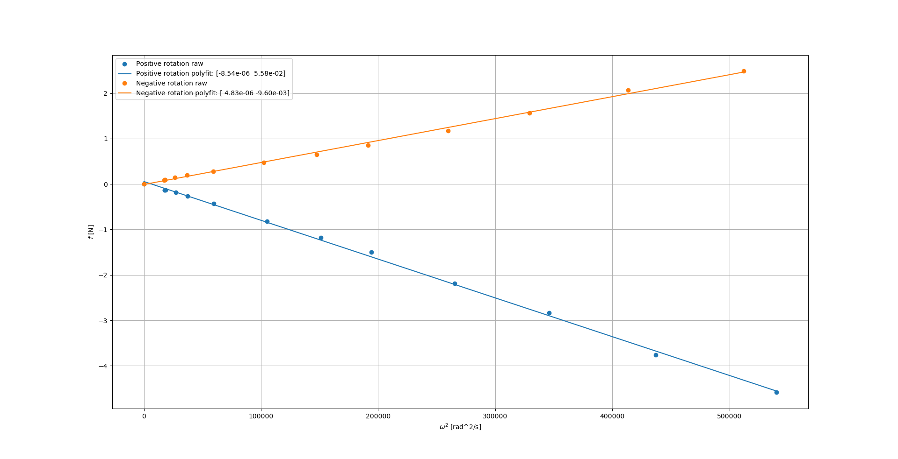
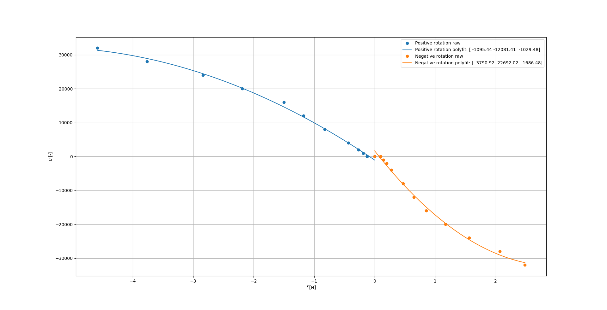

Drone
*****************
The drone a.k.a "Ugglan" (Swedish for owl) is a DIY build
quadcopter, using the Raspberry Pi Zero.

Some in-depth parts of the Modeling, State Estimation and Control
are not covered in this document, for details see the arthur's master thesis
`Design, Modeling and Control of an Octocopter <http://www.diva-portal.org/smash/get/diva2:857660/FULLTEXT01.pdf>`_.

Software
=================
TODO: Design of sampling sensors, executing the control loop, data logging and
updating the motors.
TODO: Producer and consumer structure.

Hardware
=================
TODO: Overview of the Hardware and connected busses.
TODO: Picture of Ugglan.
The drone hardware components are is listed below

* Raspberry Pi Zero
* Diatone Q450 with PCB
* Pololu AltIMU-10 v4
* Aftro ESC 20 A
* Turnigy Evolution Digital AFHDS 2A RC transmitter & controller
* TGY-iA6C RC receiver
* ZIPPY Compact 3300mAh 3S (or similar)
* DC-DC step down voltage regulator 5V
* Turnigy 2830 900KV L2215J-900 Brushless Motor

In addition, miscellaneous self manufactured components such as a cut plexiglas
are used for mounting and connecting. See Figure X.

Modeling
===============
TODO: Summary of master thesis work.

Moment of Inertia
------------------
TODO: Simulation & Empirical

Motor Dynamics
------------------
The force and torque control inputs :math:`u_z`, :math:`u_\phi`, :math:`u_\theta`
and :math:`u_\psi` have to be converted to individual motor control inputs
:math:`u_i`. This relation can be described as following

.. math::

    \begin{bmatrix}
        f_z \\
        m_x \\
        m_y \\
        m_z
    \end{bmatrix} =
    \underbrace{
        \begin{bmatrix}
            -1 & -1 & -1 & -1 \\
            -1 & -1 & 1 & 1 \\
            1 & -1 & -1 & 1 \\
            -1 & 1 & -1 & 1
        \end{bmatrix}
    }_H
    \begin{bmatrix}
        f_1 \\
        f_2 \\
        f_3 \\
        f_4
    \end{bmatrix}

where :math:`f_i` is the force produced by each motor :math:`i`. By computing
:math:`H^{-1}` one gets

.. math::

    [f_1, f_2, f_3, f_4]^\intercal = H^{-1} [f_z, m_x, m_y, m_z]^\intercal

where

.. math::
    H^{-1} = \frac{1}{4}
        \begin{bmatrix}
            -1 & -1 & 1 & -1 \\
            -1 & -1 & -1 & 1 \\
            -1 & 1 & -1 & -1 \\
            -1 & 1 & 1 & 1
        \end{bmatrix}.

Note :math:`H^{-1} = H^\intercal` since it is an orthogonal matrix. Typically
one uses the fact that :math:`\omega_{i}^2 \propto f_i` to convert forces to raw
motor control inputs, see :numref:`ang_rate_sq_vs_thrust`. However, one can
directly create a map :math:`u_i \mapsto f_i`, see :numref:`thrust_vs_command`.

.. _ang_rate_sq_vs_thrust:

    Motor angular rate and its corresponding generated thrust. Positive
    rotation corresponds to the "intended" propeller rotation i.e., not
    driven in reverse.

.. _thrust_vs_command:

    Motor control input and its corresponding generated thrust.

Hence, the resulting conversion from force and raw motor input is

.. math::
    u_i =
    \begin{cases}
        -1095f_i^2 - 12081f_i - 1029 & \text{if } f_i \leq 0 \\
        3791f_i^2 - 22692f_i + 1686 & \text{otherwise}
    \end{cases}

Note, :math:`u_i` should also be range limited since is it a ``int16`` (and the
approximation using a 2nd order is poor at low :math:`\omega`).

State Estimation
=================
TODO: Summary of master thesis work.

Control
=================
TODO: Summary of master thesis work. With reversible engine control.
