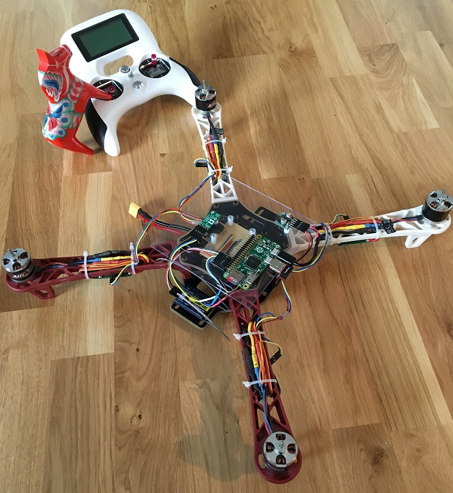
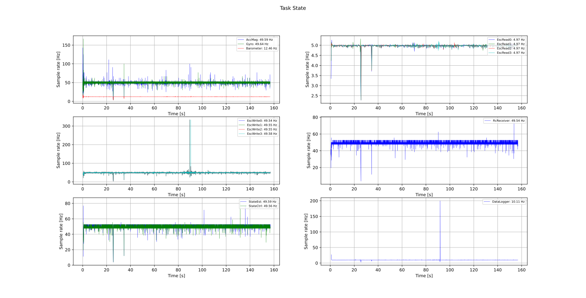
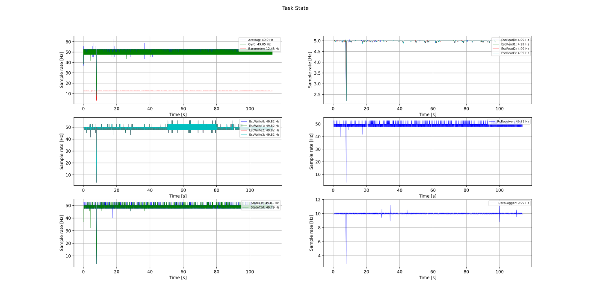
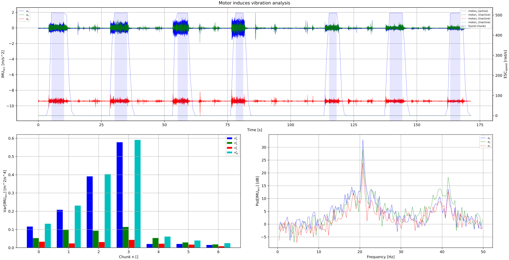

Hardware Design
*****************
.. _ugglan_in_person:

    Ugglan in person.

Components
==============
The drone hardware components are is listed below

* Raspberry Pi Zero 2 W
* Diatone Q450 with PCB
* Pololu AltIMU-10 v4
* Afro ESC 20 A
* Turnigy Evolution Digital AFHDS 2A RC transmitter & controller
* TGY-iA6C RC receiver
* ZIPPY Compact 3300mAh 3S (or similar)
* DC-DC step down voltage regulator 5V
* Turnigy 2830 900KV L2215J-900 Brushless Motor

In addition, miscellaneous self manufactured components such as a cut plexiglas
are used for mounting, see :numref:`ugglan_in_person`.

.. _devices_and_busses:

Devices & Busses
==================
The IMU's and ESC's are communicating with the Pi over i2c. The IMU can run at 400 kHz (fast mode)
and is using the built-in HW. But, the ESC's only run stable at 100 kHz (normal mode) and are
therefore using a SW implementation (i2c-gpio overlay, bit-banging over GPIO 23-24). The RC receiver
is communicating over UART, a serial connection. See overview in :numref:`connected_busses`.

.. _connected_busses:
.. mermaid::
    :caption: Overview of the hardware devices connected to the Pi Zero 2 W and their respective protocols.

    graph TD
        Esc_i -- i2c read 100 kHz --> Raspi
        Raspi -- i2c write 100 kHz --> Esc_i
        Imu_i -- i2c read 400 kHz --> Raspi
        RcReceiver -- uart read 115200 bps --> Raspi

Wiring
==================
.. _wiring_diagram:

    Wiring diagram.

Single core vs. Multi core
============================
During the project, the Raspberry Pi Zero single core processor was upgraded to a 2 W multi core
processor. As the application is utilizing threading, it was interesting to compare the
application performance between the two.

In :numref:`task_exec_rate_single_core` and :numref:`task_exec_rate_multi_core` the task execution
rates in time is shown. As one can see, the execution rates on the multi core processor are much smoother.

.. _task_exec_rate_single_core:

    Task execution rates on the single core Raspberry Pi Zero.

.. _task_exec_rate_multi_core:

    Task execution rates on the multi core Raspberry Pi Zero 2 W.

.. _vibrations_and_attenuation:

Vibrations & Attenuation
=========================
The rotating motor with propeller is a source for mechanical vibrations. Un-balanced motors and propellers
will induce vibrations and can cause issue during state estimation e.g., the vibration will propagate thru
the frame to the IMU and cause un-wanted noise.

Motor & Propeller Balancing
^^^^^^^^^^^^^^^^^^^^^^^^^^^^
To reduce vibrations the motor and propeller need to be balanced. To analyze and balance them the acceleration
can be studied. In :numref:`vib_analysis_prop_balancing` the acceleration and its variance is shown for
different runs where a pice of tape is positioned at different locations on a propeller.

.. _vib_analysis_prop_balancing:

    Each chunk corresponds to a separate run of the motors where the pice of tape is relocated. Note,
    chunk 0 is without any tape, chunk 1-3 is tape on one blade and chunk 4-6 on the other blade.

It can be seen that applying tape can significantly reduce vibrations compare to none. Hence,
by doing this for every motor and propeller the overall level of vibrations will reduce.
