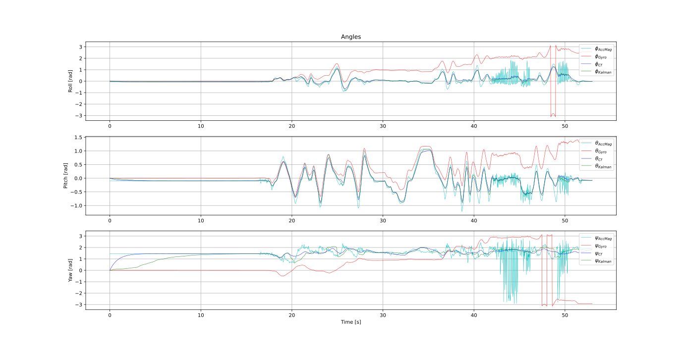
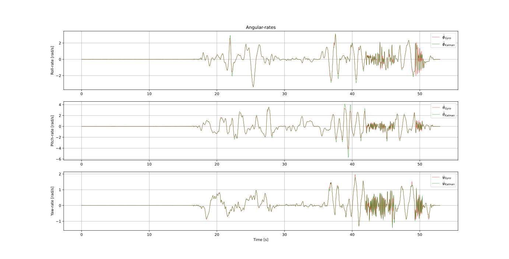
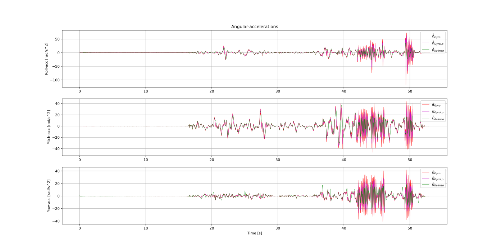
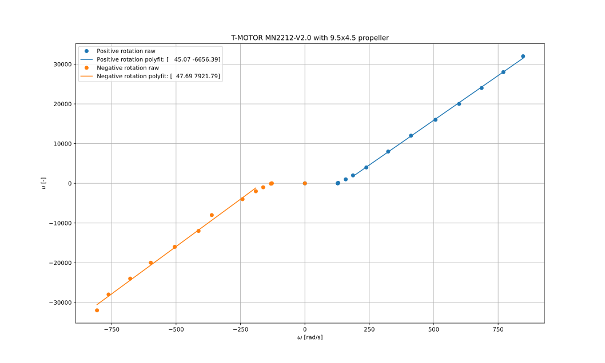

Modeling & Control
*******************
.. _drone_multi_body:
.. figure:: figures/drone_multi_body.png
    :width: 100%

    Multi body analysis of the drone.

Before moving on, note that some in-depth parts of the modeling, state estimation
and Control are not covered in this document, for details see the arthur's master
thesis `Design-Modeling-and-Control-of-an-Octocopter`_.

.. _Design-Modeling-and-Control-of-an-Octocopter: http://www.diva-portal.org/smash/get/diva2:857660/FULLTEXT01.pdf

Nomenclature
===================
:math:`_{I}` Inertial reference frame

:math:`_{B}` Body reference frame

:math:`\tau` Time-constant

:math:`M` Torque

:math:`F` Force

Inertia
===================

Multi Body Modeling
---------------------
Using multi body analysis of the drone and its components, the total drone
(mass and moments) inertia is estimated, see :numref:`drone_multi_body`.
This results in the following inertia estimates

.. math::

    I_{est} =
    \begin{bmatrix}
        0.014 & 0 & 0 \\
        0 & 0.014 & 0 \\
        0 & 0 & 0.026
    \end{bmatrix} \text{kgm}^2

and :math:`m_{est}=1.071` kg. For comparison, the measured weight is :math:`m_{meas}=1.096` kg.
Also its center of mass w.r.t the top frame is located at :math:`CM_{est}=[0, -0.001, -0.009]` m.
Hence, a rather good weight distribution.

The Pendulum Experiment
------------------------
In `Design-Modeling-and-Control-of-an-Octocopter`_ (Section 2.2) an experiment is proposed for
estimation the rotational moment of inertia. This by measuring the period time of a rigid body
rotating about an axis suspended by two strings i.e., bifilar pendulum.

Without going into the details, :math:`I_{zz}` was estimated by suspending the drone by two
strings apart :math:`D=0.46` m with length :math:`L=2.16` m, see :numref:`pendulum_experiment`.

.. _pendulum_experiment:

    Ugglan suspended by two strings - help?!

In total 10 measurements where made of the number of periods and the total time, listed in
:numref:`table_pendulum`.

.. _table_pendulum:

.. table:: :math:`N` number of periods and :math:`t` total time.

    =======  =======
    N        t [s]
    =======  =======
    10       19.3
    10       19.4
    15       29.2
    15       29.1
    20       39.0
    20       38.8
    25       48.2
    25       48.2
    30       58.1
    30       57.8
    =======  =======

Computing the mean period yields :math:`T=1.94` s. This in terms results in
:math:`I_{zz}=0.025 \text{ kgm}^2`. This can be seen as an validation of the estimation
from the multi body modeling.

Motor Dynamics
================
The motor dynamics, :math:`u_{M_i}\rightarrow\omega_{M_iz}` are modelled as a simple first order
LTL system (low-pass filter)

.. math::

    \Omega_{M_iz}(s) = \frac{1}{\tau_M s + 1}U_{M_i}(s)

where :math:`\tau_M` is the motor time constant. The time constant can be estimated by analyzing
the systems step response. By assuming :math:`\omega_{M_i}(0) = u_0` and
:math:`\omega_{M_i}(\infty) = u_\infty`, before and after the step response as settled, one gets

.. math::

    \omega_{M_i}(t) = u_\infty + (u_0 - u_\infty) e^{\frac{-t}{\tau_M}}

which can be re-written as

.. math::

    \ln\left(\frac{u_\infty - u_0}{u_\infty - \omega_{M_i}(t)}\right) = \tau_M^{-1} t

assuming :math:`u_\infty > u_0`. By then measuring :math:`\omega_{M_i}` and :math:`t` one can
estimate :math:`\tau_M` by using least squares regression. Note the data points for the regression
should be selected such that the problem is well conditioned i.e.,
:math:`\omega_{M_i} \lesssim u_\infty`.

In :numref:`tau_motor_dynamics` the time constant is estimated. One can see that it does vary
and decrease with an increasing :math:`u_0`, introducing a non-linearity. Moreover,
:math:`\tau_M` varies for positive and negative steps.

The seen effects have to be neglected to keep linearity. Therefore, the resulting time constant
is given by the mean of the steps responses where :math:`\omega_M \in [400, 800]` i.e., within
normal operating conditions. This gives :math:`\tau_M = 0.08`.

.. _tau_motor_dynamics:
.. figure:: figures/tau_motor_dynamics.svg
    :width: 100%

    Positive and negative motor step responses (with mounted propeller). The time constant
    is estimated for each step using MLSE.

On a further note. The approximation of using a first order low pass filter is fine. But from the
figure it becomes clear that better approximations of higher order exist. An improvement would
be to empirical derive such a system - by using system identification.

Linearized State Space
=======================
The same linearized (SIMO) state-space representation as derived in
`Design-Modeling-and-Control-of-an-Octocopter`_ (Section 3.7) is used i.e.,

.. math::

    \mathbf{\dot{x}_i} &= \mathbf{A_i x_i} + \mathbf{B_i} u_i \\
    \mathbf{y_i} &= \mathbf{C_i x_i} + \mathbf{D_i} u_i, i = 1,2,...,6

where :math:`\mathbf{x_i}\in\mathbb{R}^3`, :math:`\mathbf{y_i}\in\mathbb{R}^2` and

.. math::
    :label: state_space_matrices

    \mathbf{A_i}=
    \begin{bmatrix}
        0 & 1 & 0 \\
        0 & 0 & 1 \\
        0 & 0 & -\tfrac{1}{\tau_M}
    \end{bmatrix},
    \mathbf{B_i}=
    \begin{bmatrix}
        0 \\
        0 \\
        \tfrac{c_i}{\tau_M}
    \end{bmatrix},
    \mathbf{C_i}=
    \begin{bmatrix}
        1 & 0 & 0 \\
        0 & 1 & 0 \\
        0 & 0 & 1
    \end{bmatrix},
    \mathbf{D_i}= 0.

Here :math:`\mathbf{c} = [\tfrac{1}{m}, \tfrac{1}{m}, \tfrac{1}{m}, \tfrac{1}{I_{xx}},
\tfrac{1}{I_{yy}}, \tfrac{1}{I_{zz}}]`. For instance :math:`i = 4` corresponds to the
state-space representation in roll

.. math::

    \mathbf{x_4}=
    \begin{bmatrix}
        \phi \\
        \dot\phi \\
        \ddot\phi \\
    \end{bmatrix},
    u_4=u_\phi,
    c_4=\tfrac{1}{I_{xx}}.

Note, the final state e.g., :math:`\ddot\phi` is estimated using a Kalman filter,
see :ref:`attitude-estimation`. This differs from the master thesis, where it was
estimated using a reduced observer.

State Estimation
=================

.. _attitude-estimation:

Attitude Estimation
--------------------
For attitude control, the Euler angles :math:`\eta = [\phi, \theta, \psi]` and their respective
time derivatives :math:`\dot{\eta}` (angular rates) and :math:`\ddot{\eta}` (angular accelerations)
are needed.

Geometry of IMU
^^^^^^^^^^^^^^^^
The euler angles can directly be computed from the IMU's accelerometer and magnetometer using
the geometrical relationships

.. math::

    \phi_{acc} &= \text{atan2}(-a_{By}, -a_{Bz}) \\
    \theta_{acc} &= \text{atan2}(a_{Bx}, \sqrt{a_{By}^2 + a_{Bz}^2}) \\
    \psi_{mag} &= \text{atan2}(-B_{Iy}, B_{Ix})

where

.. math::

    B_{Ix} &= B_{Bx}\cos(\theta) + B_{By}\sin(\phi)\sin(\theta) + B_{Bz}\sin(\theta)\cos(\phi) \\
    B_{Iy} &= B_{By}\cos(\phi) - B_{Bz}\sin(\phi)

and :math:`a_B` is the acceleration and :math:`B_B` is the earths magnetic field supplied by the
IMU in the body frame. Where :math:`B_{Ix}` and :math:`B_{Iy}` are the magnetic fields in the
inertial frame.

However, the estimates are noisy (see :numref:`ang_est`) and need to be enhanced
e.g., by filtering.

Kalman Filter
^^^^^^^^^^^^^^
A full state attitude estimation can be accomplished by using a Kalman filter (MLSE filter which assumes
linearity and Gaussian noise) see e.g., `Wikipedia <https://en.wikipedia.org/wiki/Kalman_filter>`_ for
details. This is a rather common approach for attitude estimation given the IMU outputs. So, without
going into the details, the time discretized state space model in this case becomes

.. math::
    :label: kalman_filter_ss

    \mathbf{F}=
    \begin{bmatrix}
        1 & \Delta t & \tfrac{\Delta t^2}{2} \\
        0 & 1 & \Delta t \\
        0 & 0 & 1
    \end{bmatrix},
    \mathbf{B}= 0,
    \mathbf{H}=
    \begin{bmatrix}
        1 & 0 & 0 \\
        0 & 1 & 0
    \end{bmatrix}

with the selected covariance matrices

.. math::
    :label: kalman_filter_cov

    \mathbf{Q}= \kappa_{Q}
    \begin{bmatrix}
        \tfrac{\Delta t^4}{4} & \tfrac{\Delta t^3}{2} & \tfrac{\Delta t^2}{2} \\
        \tfrac{\Delta t^3}{2} & \Delta t^2 & \Delta t \\
        \tfrac{\Delta t^2}{2} & \Delta t & 1
    \end{bmatrix},
    \mathbf{R}=
    \begin{bmatrix}
        \kappa_{R_0}\sigma_{acc|mag}^2 & 0 \\
        0 & \kappa_{R_1}\sigma_{gyro}^2
    \end{bmatrix},
    \mathbf{P}_0= 0.

Here :math:`\sigma_{acc|mag}^2` and :math:`\sigma_{gyro}^2` is the variance of the imu
angle (accelerometer and magnetometer only) and gyro respectively. They are continuously
computed using a rolling variance. :math:`\kappa` is a scaling factor and used for tuning.

See :ref:`estimator-performance` for the final performance
and comparison w.r.t to other filtering methods.

Complementary filter
^^^^^^^^^^^^^^^^^^^^^
Another method to improve the (angle only) estimates is to use a first order complementary filter -
fusing the accelerometer angles with the integrated gyro estimates (see
`IMU Data Fusing <http://www.olliw.eu/2013/imu-data-fusing/>`_)

.. math::

    \tilde{\phi}^{k} &= \text{cf}(\phi_{acc}^k, \dot{\phi}_{gyro}^k, \tilde{\phi}^{k-1}, \tau_{\phi}) \\
    \tilde{\theta}^{k} &= \text{cf}(\theta_{acc}^k, \dot{\theta}_{gyro}^k, \tilde{\theta}^{k-1}, \tau_{\theta}) \\
    \tilde{\psi}^{k} &= \text{cf}(\psi_{mag}^k, \dot{\psi}_{gyro}^k, \tilde{\psi}^{k-1}, \tau_{\psi})

where

.. math::

    y^{k} &= \text{cf}(u^k, \dot{u}^k, y^{k-1}, \tau) \\
            &= \alpha(y^{k-1} + \dot{u}^k\Delta t) + (1-\alpha)u^k

where :math:`\alpha = \tfrac{\tau}{\tau + \Delta t}` and :math:`\tau` is the cut-off frequency
(:math:`\tau = \tfrac{1}{2 \pi f_c}`).

.. _estimator-performance:

Estimator Performance
^^^^^^^^^^^^^^^^^^^^^^
In :numref:`ang_est` - :numref:`ang_acc_est` the final performance of the attitude
estimation is show for different estimators.

.. _ang_est:

    Angle estimation using the IMU (accelerometer + magnetometer), integrated gyro,
    complementary filter and the Kalman filter.

.. _ang_rate_est:

    Angular rate estimation using the gyro output and the Kalman filter.

.. _ang_acc_est:

    Angular acceleration estimation using the derivative of the gyro (w/o a LP-filter)
    and the Kalman filter.

Implementation Notes
^^^^^^^^^^^^^^^^^^^^^

Kalman Filter
"""""""""""""""""
In order to solve for the optimal Kalman gain, matrix operations (e.g., inverse) have
to be performed. For this `Eigen <https://eigen.tuxfamily.org/>`_ is used.

Gyro offset
""""""""""""
The gyro output contains an offset/bias which needs to be compensated for. This
can simply be estimated during the standstill of the drone.

Range Limit
"""""""""""""""
The estimates need to be range limited i.e., modulo of the euler angles e.g.,
:math:`\theta \in [-\pi, \pi]`.

Hard Iron Offset
"""""""""""""""""
Magnetic fields affecting the magnetometer other than earth's need to be compensated
for. One of those is hard iron (the other being soft iron) effects. These are static
magnetic fields e.g., components on the PCB.

These offsets can easily be estimated using least squares (offset of a sphere)

.. math::

    \underset{V}{\text{minimize}} (B-V)^T (B-V) = B^2.

To get a good estimate, the magnetometer should be rotated in space to excite all
directions, see :numref:`hard_iron_offset`.

.. _hard_iron_offset:
.. figure:: figures/hard_iron_offset.svg
    :width: 100%

    Hard iron offset estimation and correction.

.. _force-torque-estimation:

State Control
=================
The drone's dynamics are stabilized using a full state feedback controller

.. math::
    :label: cont_state_feedback

    u = -\mathbf{Lx}.

Which allows for arbitrary pole placement, see `Design-Modeling-and-Control-of-an-Octocopter`_
for in depth details.

Pilot Control
---------------------
Typically, the pilot controller (using the handheld controller), seeks for stability
of roll, pitch and yaw-rate. To tune :math:`\mathbf{L}`, the step response of the
closed loop is analyzed, see :numref:`tune_ctrl_roll_pitch`-:numref:`tune_ctrl_yaw_rate`.
Note, an integrated state has been added for roll and pitch control (already in place
for yaw-rate) i.e., :math:`\mathbf{x}\in\mathbb{R}^4`.

.. _tune_ctrl_roll_pitch:

    Tuning and parameter selection for roll and pitch control.

.. _tune_ctrl_yaw_rate:

    Tuning and parameter selection for yaw-rate control.

In the above figures the abs-max value of the integrated state (reference error)
is also shown to determine a suitable value for anti-windup i.e., to handle a
large overshoot/instability caused by the integration.

In :numref:`rc_gimbal_def_pilot` the RC-gimbal definitions for the pilot controller
are given.

.. _rc_gimbal_def_pilot:
.. figure:: figures/rc_gimbal_def_pilot.svg
    :width: 75%

    RC-gimbal definitions for the pilot controller. The arrow indicates
    positive direction. Note that thrust implies negative :math:`F_z` i.e., lift.

Motor Control
=================
The body force and torque control inputs :math:`u_{Bz}`, :math:`u_{B\phi}`,
:math:`u_{B\theta}` and :math:`u_{B\psi}` have to be converted to individual
motor control inputs :math:`u_{M_i}`.

.. _motor_rotations:
.. figure:: figures/motor_rotations.svg
    :width: 75%

    The drone motor rotational directions.

From :numref:`motor_rotations` one can derive the drone body forces and
torques generated by the motors

.. math::

    F_{Bx} &= 0 \\
    F_{By} &= 0 \\
    F_{Bz} &= - F_{M_1z} - F_{M_2} - F_{M_3} - F_{M_4z} \\
    M_{Bx} &= - l_xF_{M_1z} - l_xF_{M_2z} + l_xF_{M_3z} + l_xF_{M_4z} \\
    M_{By} &=   l_xF_{M_1z} - l_xF_{M_2z} - l_xF_{M_3z} + l_xF_{M_4z} \\
    M_{Bz} &= - M_{M_1z} + M_{M_2z} - M_{M_3z} + M_{M_4z}

where :math:`F_{M_ix} = F_{M_iy} = M_{M_ix} = M_{M_iy} = 0` and
:math:`l_x = 0.23` m (distance between body center of mass and motor).

In order to solve for the motor inputs one can use the fact that
:math:`F, M \propto \omega^2`, where :math:`\omega` is the angular rate of a
motor/propeller, see :numref:`ang_rate_sq_vs_thrust`.

.. _ang_rate_sq_vs_thrust:

    Motor angular rate and its corresponding generated thrust. Positive
    rotation corresponds to the "intended" propeller rotation i.e., not
    driven in reverse. Fitted a 1st-order polynomial :math:`y = X[p_1]^\intercal`.

Hence, the generated body forces and torques can be described as following

.. math::

    \begin{bmatrix}
        F_{Bz} \\
        M_{Bx} \\
        M_{By} \\
        M_{Bz}
    \end{bmatrix} =
    \underbrace{
        \begin{bmatrix}
            -c_{Fz} & -c_{Fz} & -c_{Fz} & -c_{Fz} \\
            -l_xc_{Fz} & -l_xc_{Fz} & l_xc_{Fz} & l_xc_{Fz} \\
            l_xc_{Fz} & -l_xc_{Fz} & -l_xc_{Fz} & l_xc_{Fz} \\
            -c_{Mz} & c_{Mz} & -c_{Mz} & c_{Mz}
        \end{bmatrix}
    }_H
    \begin{bmatrix}
        \omega_{M_1z}^2 \\
        \omega_{M_2z}^2 \\
        \omega_{M_3z}^2 \\
        \omega_{M_4z}^2
    \end{bmatrix}.

By computing :math:`H^{-1}` one gets

.. math::

    [\omega_{M_1z}^2, \omega_{M_2z}^2, \omega_{M_3z}^2, \omega_{M_4z}^2]^\intercal
    = H^{-1} [F_{Bz}, M_{Bx}, M_{By}, M_{Bz}]^\intercal

where

.. math::
    H^{-1} = \frac{1}{4}
        \begin{bmatrix}
            -\tfrac{1}{c_{Fz}} & -\tfrac{1}{l_xc_{Fz}} & \tfrac{1}{l_xc_{Fz}} & -\tfrac{1}{c_{Mz}} \\
            -\tfrac{1}{c_{Fz}} & -\tfrac{1}{l_xc_{Fz}} & -\tfrac{1}{l_xc_{Fz}} & \tfrac{1}{c_{Mz}} \\
            -\tfrac{1}{c_{Fz}} & \tfrac{1}{l_xc_{Fz}} & -\tfrac{1}{l_xc_{Fz}} & -\tfrac{1}{c_{Mz}} \\
            -\tfrac{1}{c_{Fz}} & \tfrac{1}{l_xc_{Fz}} & \tfrac{1}{l_xc_{Fz}} & \tfrac{1}{c_{Mz}}
        \end{bmatrix}.

From :numref:`ang_rate_sq_vs_thrust` it can be seen that :math:`c_{Fz}` is smaller (about half)
when the motor is reversing (negative rotation). This is probably due to the non-symmetrical
shape of the propeller. Hence, a non-linearity arises and :math:`H^{-1}` can't solely be used.
Therefore reversing will for now not be used, maybe in the future.

Anyhow, :numref:`ang_rate_sq_vs_thrust` also gives :math:`c_{Fz} = -8.37\times 10^{-6}` (positive rotation
from now on only). The torque constant is given by :math:`c_{Mz} = \tfrac{1}{50} c_{Fz}` - empirical
relation from the master thesis.

In :numref:`ang_rate_vs_command` the empirical relation between the raw motor
control inputs and the angular rates is given.

.. _ang_rate_vs_command:

    The motor angular rates and raw control inputs. Fitted a 1nd-order polynomial
    :math:`y = X[p_1, p_0]^\intercal`. Note, first 5 values are not included in the
    regression for a better fit - not a commonly used interval. Also note the
    symmetry about :math:`u`.

Hence, the final conversion is given by

.. math::
    u_{M_i} =
    \begin{cases}
        57\omega_{M_iz} - 9675 & \text{if } \omega_{M_iz} \geq 200 \\
        0 & \text{otherwise}
    \end{cases}.

Note, :math:`u_{M_i}` should also be range limited since is it a ``int16`` and reversing
is not used.
